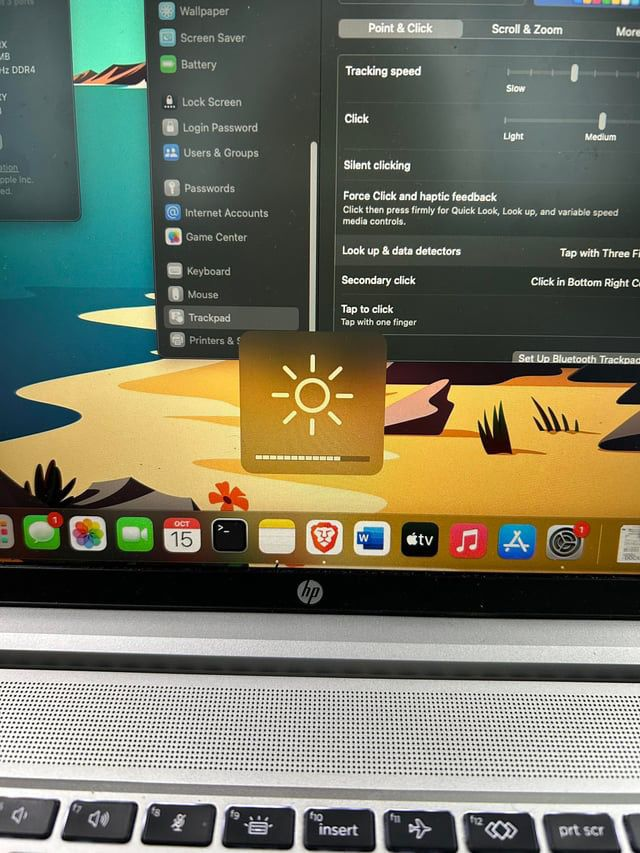
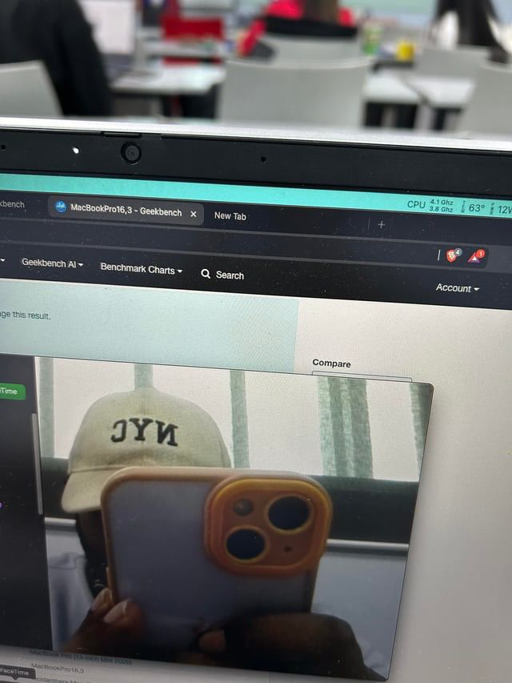
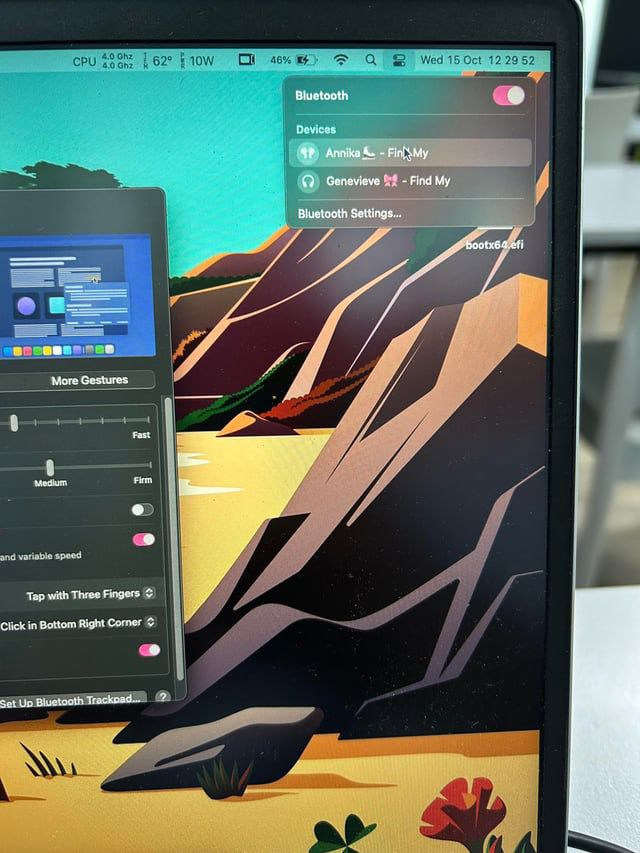
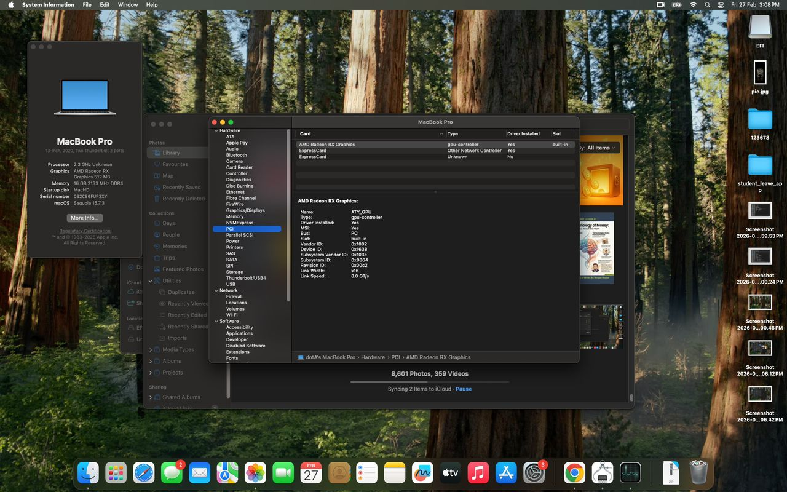
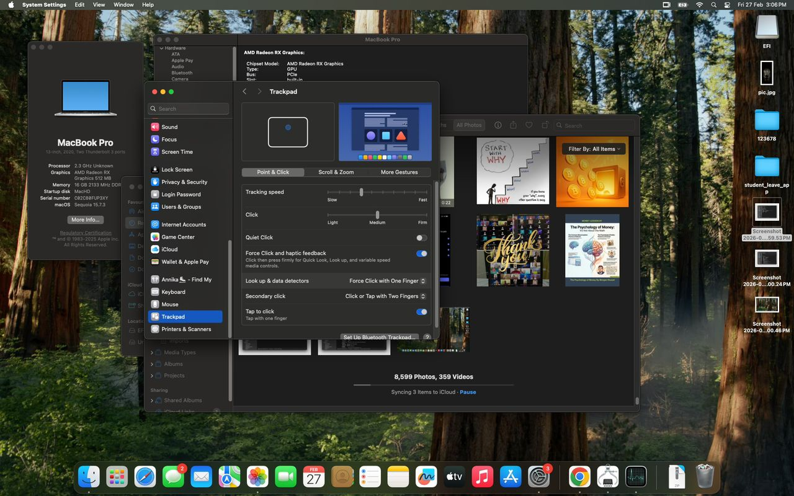
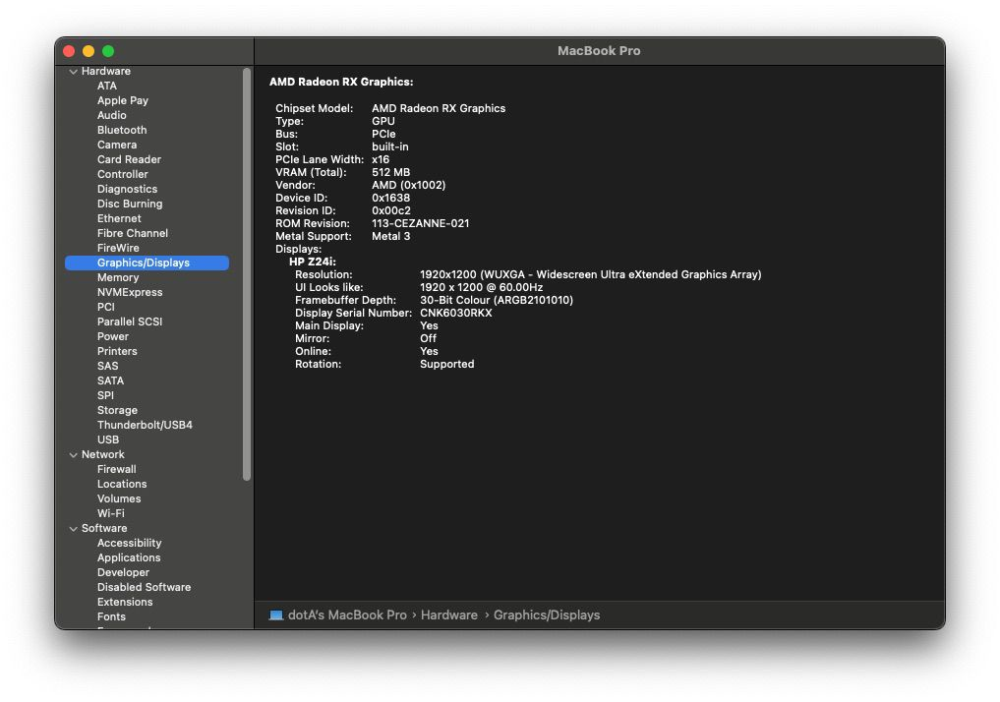
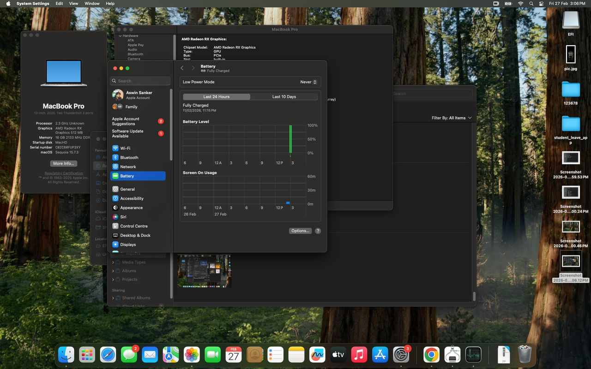
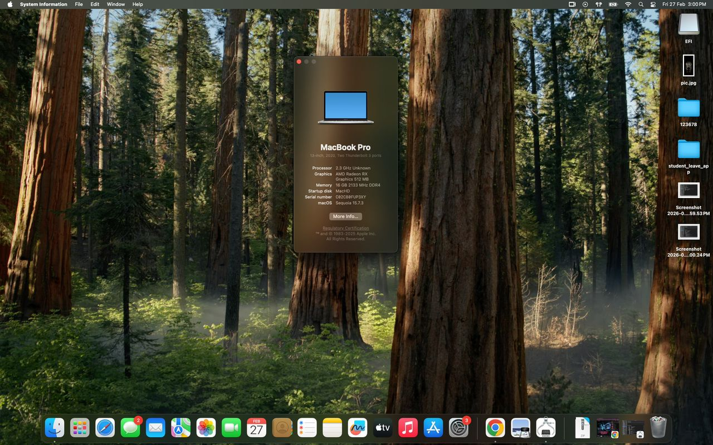
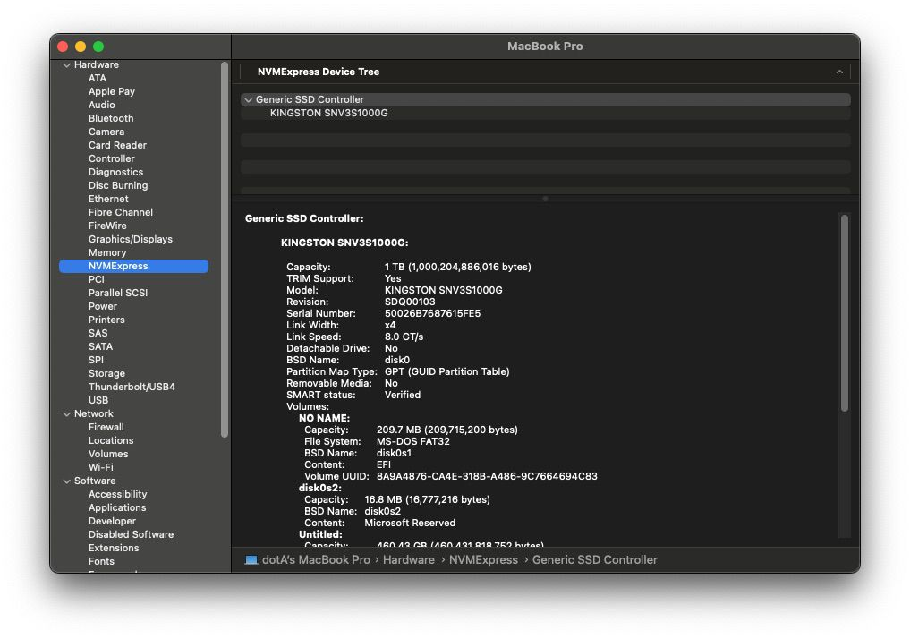

# Hackintosh HP Laptop
This is Hackintosh EFI for my laptop HP Probook based on OpenCore.\
This is some information about my laptop:
* Name: HP Probook 455 G8
* Chipset: AMD Ryzen 5 5600U
* Onboard graphic: AMD Radeon RX Vega Graphics
* Audio: Realtek ALC236 Layout-ID 3
* Display: 15.6" 1920x1080
* Touchpad: Elan 0736 I2C HID Trackpad
* Camera: HP TrueVision HD Camera
* Port: 2x USB 3.0, 1x USB Type-C, 1x 3.5mm audio jack, 1x HDMI Port
* Wifi card: Intel Wireless AC-8265

## What working?
- [x] Audio
- [x] Camera
- [x] Battery Management
- [x] Wifi with Intel AC 7265
- [x] USB
- [x] iCloud
- [x] iMessage, Facetime
- [x] Keyboard
- [x] Bluetooth
- [x] Onboard Graphics
- [x] Touchpad
- [x] Brightness
- [x] Internal Mic
## What not working?
- [ ] Airdrop,Handsoff
## What Not Tested?
- [ ] Sleeping
- [ ] Audio Port
- [ ] Power Management

## Images

